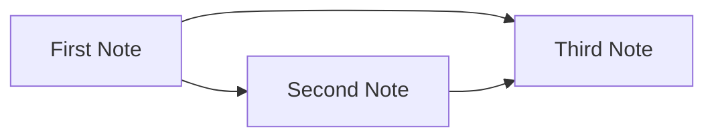

This note is linked to [[first-note]] and also references [[third-note]]. Backlinks to it should appear on the First Note page.

## Table

| Quartz Version | Config               | Release Year |
| -------------- | -------------------- | ------------ |
| v3             | `quartz.config.ts`   | 2023         |
| v4             | `quartz.config.ts`   | 2024         |
| v5             | `quartz.config.yaml` | 2026         |

## A bit more formatting

Arrows are converted automatically: A -> B, C <- D, E <-> F.

Block reference to the paragraph below: [[second-note#^important-block]]

This is an important paragraph that can be referenced via a block link. ^important-block

## Callout with a diagram

> [!info] How connections are structured
> Below is a simple mermaid diagram embedded directly into the note.

## Nested task list

- Site sections
  - [x] Home
  - [x] Notes
  - [ ] Tags
    - [ ] Tag page 
    - [ ] Tag page