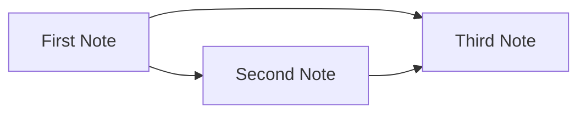

Эта заметка связана с [[first-note]] и также ссылается на [[third-note]]. Обратные ссылки на неё должны появиться на странице First Note.

## Таблица

| Версия Quartz | Конфиг              | Год выхода |
| ------------- | -------------------- | ---------- |
| v3            | `quartz.config.ts`   | 2023       |
| v4            | `quartz.config.ts`   | 2024       |
| v5            | `quartz.config.yaml` | 2026       |

## Ещё немного форматирования

Стрелки конвертируются автоматически: A -> B, C <- D, E <-> F.

Блок-ссылка на абзац ниже: [[second-note#^important-block]]

Это важный абзац, на который можно сослаться через блок-ссылку. ^important-block

## Callout с диаграммой

> [!info] Как устроены связи
> Ниже — простая диаграмма mermaid, встроенная прямо в заметку.

## Вложенный список с задачами

- Разделы сайта
  - [x] Главная
  - [x] Заметки
  - [ ] Теги
    - [ ] Страница тега #test
    - [ ] Страница тега #демо
